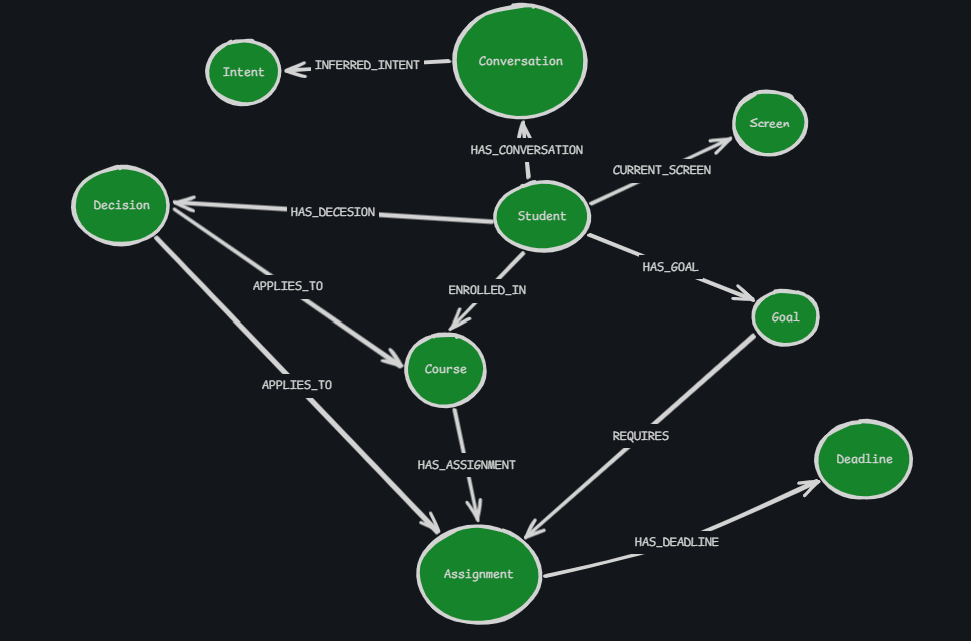
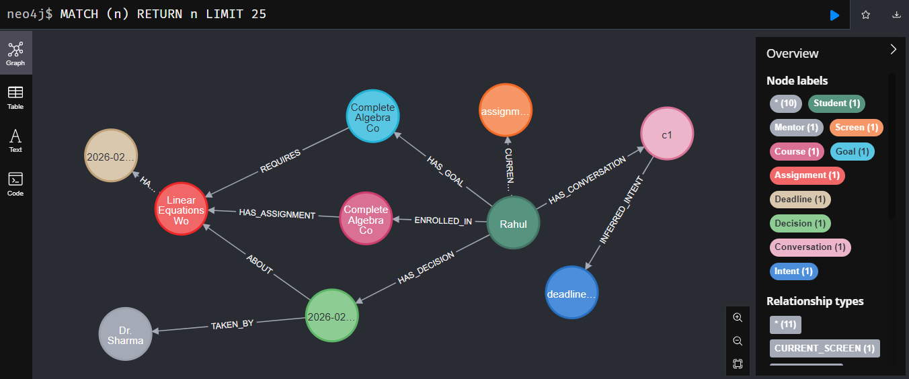

# Context-Graph Conversational AI Assistant — Demo

<p align="center">
  
</p>

A minimal demo that shows how a **context graph** (backed by Neo4j) can be used to improve LLM responses for a student-facing co-pilot. The repo contains:

- an in-memory prototype (used during development)  
- a Neo4j-backed implementation (seed + queries)  
- a deterministic mock LLM fallback and a Groq inference client option  
- a baseline (no graph) and a graph-aware pipeline to compare responses

---

## 📚 Table of Contents

- [Intro](#intro)  
- [Quick status / what’s included](#quick-status--whats-included)  
- [Requirements](#requirements)  
- [How to run (local)](#how-to-run-local)  
  - [1) Start Neo4j (Docker)](#1-start-neo4j-docker)  
  - [2) Prepare Python environment](#2-prepare-python-environment)  
  - [3) Environment variables](#3-environment-variables)  
  - [4) Seed the graph (idempotent)](#4-seed-the-graph-idempotent)  
  - [5) Run the demo scripts](#5-run-the-demo-scripts)  
- [How the context graph improves responses (concise)](#how-the-context-graph-improves-responses-concise)  
- [Example graph snapshot (structured)](#example-graph-snapshot)  
- [Evaluation notes](#evaluation-notes)  
  - [Limitations of the current approach](#limitations-of-the-current-approach)  
  - [Suggestions for scaling to multi-tenant SaaS](#suggestions-for-scaling-to-multi-tenant-saas)  
- [Project layout & technical docs](#project-layout--technical-docs)

---

## Intro

This repo demonstrates the difference between:

- a **baseline** LLM that receives only the user message (naive prompt stuffing) and  
- a **graph-aware** LLM pipeline that retrieves a small, relevant subgraph (assignment, deadline, active decisions, current screen, last intent) and injects these facts into the prompt with provenance.

The primary use case implemented:  
**A student asking for help while working on a goal or assignment** — the assistant uses the context graph to know who the student is, what they are working on, where they are in the app, and what decisions (e.g., an approved extension) already exist.

---

## Quick status / what’s included

- `src/graph/seed.py` — idempotent Neo4j seed (creates nodes + relationships and constraints)  
- `src/graph/queries.py` — Neo4j-backed query functions returning plain dicts  
- `src/retrieval/context_selector.py` — subgraph extraction (assignment, deadline, decisions, screen, intent, effective_deadline)  
- `src/llm/prompt_builder.py` — formats contextual facts + system instructions into an LLM prompt  
- `src/llm/client.py` — Groq API wrapper with deterministic mock fallback (controlled by `GROQ_API_KEY`)  
- `src/baseline/naive_chat.py` — baseline runner (sends only user message)  
- `src/flow/assistant_flow.py` — graph-aware pipeline (detect intent → select context → build prompt → call LLM → return answer)  
- `src/demo/run_comparison.py` — convenience script to show baseline vs graph outputs  
- `requirements.txt` — Python dependencies

---

## Requirements

- Docker (for Neo4j)  
- Python 3.10+ (virtualenv recommended)  
- `pip install -r requirements.txt` (includes `neo4j` and other lightweight deps)  
- (Optional) Groq inference API key if you want real model calls

---

## How to run (local)

### 1) Start Neo4j (Docker)

```bash
# Run a local Neo4j instance (example password: testpassword)
docker run --name neo4j-local -p7474:7474 -p7687:7687 \
  -e NEO4J_AUTH=neo4j/testpassword \
  -d neo4j:5.10
```
Access the browser UI at http://localhost:7474 (user neo4j, password testpassword).

### 2) Prepare Python environment
```bash
git clone <your-repo-url>
cd context-graph-conversational-ai-assistant

python -m venv venv
# Windows PowerShell
venv\Scripts\Activate.ps1
# macOS / Linux
source venv/bin/activate

pip install -r requirements.txt
```
`requirements.txt` should include at least: `neo4j`, `openai` (used as compatible client for Groq), and other small packages referenced in `src/`.

### 3) Environment variables
Set the following environment variables (or create a .env / .env.example and load them):
NEO4J_URI (default bolt://localhost:7687)
NEO4J_USER (default neo4j)
NEO4J_PASSWORD (example testpassword)
GROQ_API_KEY (optional — if present, src/llm/client.py will try Groq; otherwise a deterministic mock is used)
Example (Linux / macOS):
```bash
export NEO4J_URI="bolt://localhost:7687"
export NEO4J_USER="neo4j"
export NEO4J_PASSWORD="testpassword"
export GROQ_API_KEY="sk-xxxx"  # optional
```
Windows PowerShell:
```bash
$env:NEO4J_URI="bolt://localhost:7687"
$env:NEO4J_USER="neo4j"
$env:NEO4J_PASSWORD="testpassword"
$env:GROQ_API_KEY="sk-xxxx"  # optional
```

### 4) Seed the graph (idempotent)

Run the seeding script to create the small demo dataset in Neo4j:

```bash
python -m src.graph.seed.py
```
You should see a success message: ✅ Seed data created in Neo4j.
### 5) Run the demo scripts

Run the graph-aware assistant:
```bash
python -m src.flow.assistant_flow
```
Run the baseline-only chat (no graph):
```bash
python -m src.baseline.naive_chat
```
Run the comparison runner which prints baseline vs graph-aware outputs:
```bash
python src/demo/run_comparison.py
```
If you do not have GROQ_API_KEY, the system uses a deterministic mock LLM so the demo is stable and reproducible. If you set GROQ_API_KEY, the wrapper will invoke the Groq-compatible client (via openai client usage pattern) for real responses.

## How the context graph improves responses (concise)

The demo shows these concrete improvements:
- Selective, relevant facts only — the selector extracts a small subgraph (assignment, deadline, active decisions, current screen, last intent). This keeps prompts short and focused, reducing hallucination risk and cost.
- Decision awareness — the assistant can see per-user Decision nodes (e.g., extension approved for this student) and surface them, producing personalized answers (e.g., “Yes — you have an approved extension until X”).
- Continuity and provenance — conversation and decision nodes are referenced with IDs in the prompt; the assistant cites source node ids in responses which improves auditability and trust.
- Atomic updates — updates such as granting an extension are single, atomic graph writes (no rewriting long chat logs), enabling reliable state changes across turns.
- Deterministic retrieval reduces prompt noise vs naive stuffing of recent messages, improving relevance and consistency.

## Example graph snapshot

Below is a compact snapshot of the seeded demo graph (the same data src/graph/seed.py creates). This is the minimal subgraph used in the demo:

<p align="center">
  
</p>

## Evaluation Notes
### Limitations of the current approach

- Single-node Neo4j instance: demo uses a single local Neo4j instance; concurrency, sharding, and scale tests are not part of the demo.

- Privacy & PII: the demo stores minimal user info; a production system must encrypt PII and follow data retention policies.

- No sophisticated conflict resolution: when contradictory claims appear (user says “I didn’t get extension” vs an approved Decision), the demo marks confidence and would ask for clarification; a production system needs verification flows.

- Simple intent detection: current detect_intent is rule-based (keyword matching). This is sufficient for the demo but not production-grade.


### Suggestions for scaling the context graph in a multi-tenant SaaS environment

- Tenant isolation: store tenant_id on nodes and use either (a) separate subgraphs per tenant, or (b) a single graph with enforced tenant scoping on every query. Prefer separate databases for strict isolation or high-privacy tenants.

- Sharding & horizontal scaling: partition graphs by tenant or by logical domain (e.g., active session cache vs archive) and use routing layer to direct queries.

- Indexing & caching: create indexes on frequently queried properties (user_id, assignment_id, decision_id), and cache hot subgraphs (per-session snapshot) in memory or a distributed cache to reduce Neo4j load.

- Access control & RBAC: enforce role-based filters at query time so parents/counselors see only allowed facts; this can be pushed into parameterized Cypher or a middleware layer.

- Event-driven updates: use an event bus (Kafka/RabbitMQ) for writes so multiple services can subscribe to changes (e.g., UI, analytics, model retraining).

- TTL & cleanup: automatically expire ephemeral nodes (OTPs, session-only facts, temporary decisions) to keep graphs compact.

## Final notes

The demo intentionally focuses on context selection and retrieval rather than model training or large-scale deployment.
